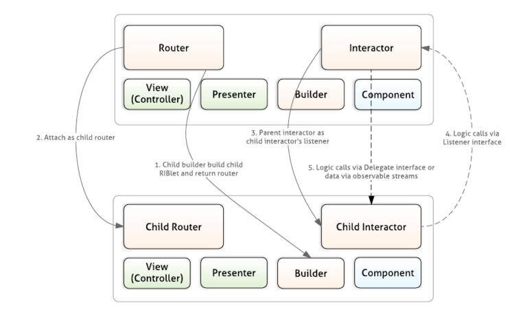

## Evolução da Arquitetura: De MVC para Riblets

A arquitetura do aplicativo Uber para motoristas passou por uma jornada de evolução, impulsionada pela necessidade de lidar com a crescente complexidade e escalabilidade da plataforma. Inicialmente, o aplicativo seguia o padrão MVC (Model-View-Controller), amplamente utilizado no desenvolvimento de software. No entanto, com o crescimento da plataforma e do código-base, as limitações do MVC se tornaram evidentes.

*   **Controllers de View Muito Grandes:** A concentração de lógica nos controllers dificultava a leitura, manutenção e teste do código.
*   **Processo de Atualização Frágil:** A falta de abstração e a complexidade dos testes tornavam as atualizações mais propensas a erros.

Em busca de uma solução, a equipe da Uber explorou o padrão VIPER (View-Interactor-Presenter-Entity-Router), que oferecia maior abstração e testabilidade. No entanto, o VIPER também apresentou limitações:

*   **Especificidade para iOS:** A arquitetura VIPER foi projetada para iOS, dificultando sua adaptação para Android.
*   **Lógica de Aplicação Orientada à Visualização:** A forte ligação entre a lógica de negócio e a árvore de visualização dificultava a reutilização do código e a realização de testes.

A solução final foi o desenvolvimento do **Riblets**, um padrão de arquitetura próprio da Uber, que combina os benefícios do VIPER com a flexibilidade e escalabilidade necessárias para a plataforma.

## Riblets: A Arquitetura do Aplicativo Uber para Motoristas

A solução final foi o desenvolvimento do Riblets, um padrão de arquitetura próprio da Uber, que combina os benefícios do VIPER com a flexibilidade e escalabilidade necessárias para a plataforma. O Riblets é uma arquitetura modular, onde a aplicação é estruturada como uma árvore de Riblets. Cada Riblet é responsável por uma parte específica da lógica de negócio ou da interface do usuário, promovendo a separação de responsabilidades e facilitando a manutenção e evolução do código.

### Componentes de um Riblet

*   **Router:** Responsável por anexar e desanexar Riblets filhos, formando a árvore da aplicação.
*   **Interactor:** Contém a lógica de negócio do Riblet.
*   **Builder:** Instancia os Riblets primários e define suas dependências.
*   **Component:** Obtém e instancia as dependências de um Riblet.
*   **Presenter (opcional):** Gerencia a comunicação entre o Interactor e a View.
*   **View (opcional):** Constrói e atualiza a interface do usuário.

### Características do Riblets

*   **Encaminhamento Guiado pela Lógica de Negócio:** A aplicação é orientada pelo fluxo da informação, não pela visualização.
*   **Agnóstico de Plataformas:** Facilita o desenvolvimento para iOS e Android.
*   **Separação Clara de Responsabilidades:** Melhora a testabilidade e a manutenção do código.
*   **Flexibilidade e Escalabilidade:** Permite adicionar e remover funcionalidades facilmente.

## Conclusão

A adoção da arquitetura Riblets permitiu que a Uber superasse os desafios de escalabilidade e complexidade do aplicativo para motoristas. A modularidade, a separação de responsabilidades e a orientação pela lógica de negócio são os pilares dessa arquitetura inovadora, que se mostrou fundamental para o sucesso da plataforma. A experiência da Uber com o Riblets demonstra a importância de escolher a arquitetura certa para atender às necessidades específicas de cada aplicação, especialmente em ambientes complexos e em constante evolução.

## Referências

*   **Engineering the Architecture Behind Uber's New Rider App:** https://www.uber.com/blog/new-rider-app-architecture/
*   **Engenharia da arquitetura por trás do novo aplicativo do motorista Uber:** https://imasters.com.br/android/engenharia-da-arquitetura-por-tras-do-novo-aplicativo-do-motorista-uber
